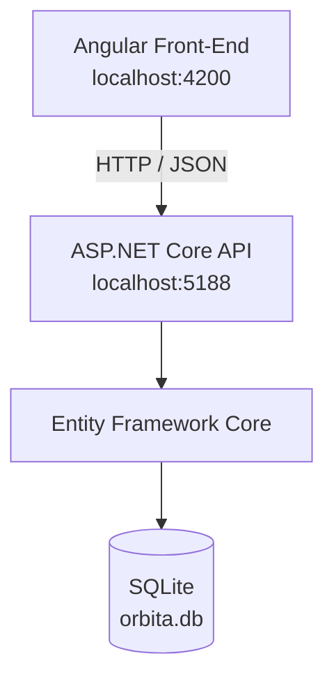

🌌 Órbita de Tarefas
Aplicação Full Stack de gerenciamento de tarefas desenvolvida para prática de integração entre Front-End e Back-End utilizando o ecossistema .NET no servidor e Angular no cliente.
O projeto implementa um CRUD completo de tarefas, persistência em banco de dados SQLite, comunicação via API REST e uma interface moderna em Angular para criação, edição, conclusão e exclusão de tarefas.
 
 
 ✨ Funcionalidades
- Listagem de tarefas persistidas no banco de dados
- Criação de novas tarefas
- Edição de título, descrição e status
- Exclusão de tarefas
- Alteração entre Pendente e Concluída
- Validação de título obrigatório
- Feedback visual para ações e erros
- Estados de carregamento e lista vazia
- Filtros e indicadores de tarefas
- Persistência de dados com SQLite
- Integração completa entre Angular e ASP.NET Core via HTTP/JSON
- Tratamento dos principais status HTTP da API

🧠 Tecnologias utilizadas
Front-End
- Angular 20
- TypeScript 5.8
- HTML5
- CSS3
- Angular HttpClient
- RxJS
Back-End
- C#
- .NET 10
- ASP.NET Core
- Entity Framework Core 10
- API REST
- LINQ
Banco de dados e ferramentas
- SQLite
- Entity Framework Migrations
- Postman
- Git e GitHub

🏗️ Arquitetura

O Angular não acessa o banco diretamente. Toda comunicação acontece através da API REST.
Angular
   ↓
HttpClient
   ↓
API REST - ASP.NET Core
   ↓
AppDbContext
   ↓
Entity Framework Core
   ↓
SQLite

## 📁 Estrutura do projeto

orbita-de-tarefas/
│
├── backend/
│   └── OrbitaTarefas.Api/
│       │
│       ├── Data/
│       │   └── AppDbContext.cs
│       │
│       ├── Migrations/
│       │   └── ...
│       │
│       ├── Models/
│       │   └── Tarefa.cs
│       │
│       ├── Properties/
│       ├── Program.cs
│       ├── appsettings.json
│       ├── appsettings.Development.json
│       └── OrbitaTarefas.Api.csproj
│
├── frontend/
│   │
│   ├── public/
│   │
│   ├── src/
│   │   │
│   │   ├── app/
│   │   │   │
│   │   │   ├── components/
│   │   │   │   ├── dialog/
│   │   │   │   ├── tarefa-form/
│   │   │   │   └── tarefa-item/
│   │   │   │
│   │   │   ├── models/
│   │   │   │   └── tarefa.ts
│   │   │   │
│   │   │   ├── services/
│   │   │   │   └── tarefa.service.ts
│   │   │   │
│   │   │   ├── app.config.ts
│   │   │   ├── app.css
│   │   │   ├── app.html
│   │   │   └── app.ts
│   │   │
│   │   ├── index.html
│   │   ├── main.ts
│   │   └── styles.css
│   │
│   ├── angular.json
│   ├── package.json
│   ├── package-lock.json
│   ├── proxy.conf.json
│   ├── tsconfig.json
│   └── tsconfig.app.json
│
├── .gitignore
└── README.md

📦 Modelo de dados
Back-End — C#
public class Tarefa
{
    public int Id { get; set; }
    public string Titulo { get; set; } = string.Empty;
    public string Descricao { get; set; } = string.Empty;
    public bool Concluida { get; set; }
}
Front-End — TypeScript
export interface Tarefa {
  id: number;
  titulo: string;
  descricao: string;
  concluida: boolean;
}

🔌 API REST
Base URL durante o desenvolvimento:
http://localhost:5188/api/tarefas
Método	Endpoint	Descrição	Resposta principal
GET	/api/tarefas	Lista todas as tarefas	200 OK
GET	/api/tarefas/{id}	Busca uma tarefa pelo ID	200 OK / 404 Not Found
POST	/api/tarefas	Cria uma nova tarefa	201 Created / 400 Bad Request
PUT	/api/tarefas/{id}	Atualiza uma tarefa	200 OK / 400 Bad Request / 404 Not Found
DELETE	/api/tarefas/{id}	Exclui uma tarefa	204 No Content / 404 Not Found

Exemplo de criação
POST /api/tarefas
Content-Type: application/json
{
  "titulo": "Estudar Angular",
  "descricao": "Integrar o Front-End com a API .NET",
  "concluida": false
}
Resposta:
{
  "id": 1,
  "titulo": "Estudar Angular",
  "descricao": "Integrar o Front-End com a API .NET",
  "concluida": false
}

⚙️ Como executar localmente
Pré-requisitos
Tenha instalado:
- .NET SDK 10
- Node.js
- npm
- Angular CLI
- Git
1. Clone o repositório
git clone https://github.com/Paulo-Vitor-dev/orbita-de-tarefas.git
cd orbita-de-tarefas
2. Prepare e execute o Back-End
cd backend/OrbitaTarefas.Api

dotnet restore
dotnet ef database update
dotnet run
A API ficará disponível em:
http://localhost:5188
Teste:
http://localhost:5188/api/tarefas
3. Execute o Front-End
Em outro terminal:
cd frontend
npm install
npm start
A aplicação ficará disponível em:
http://localhost:4200
Durante o desenvolvimento, o Angular utiliza proxy.conf.json para encaminhar as requisições de /api para a API ASP.NET Core em localhost:5188.

💾 Persistência com Entity Framework Core
O projeto utiliza Entity Framework Core como ORM e SQLite como banco de dados.
As alterações de estrutura são versionadas através de migrations. O arquivo local orbita.db não precisa ser enviado ao repositório, pois o banco pode ser reconstruído executando:
dotnet ef database update
O fluxo de persistência é:
Requisição HTTP
      ↓
ASP.NET Core
      ↓
AppDbContext
      ↓
Entity Framework Core
      ↓
SQLite

🧪 Testes realizados
Os endpoints foram validados manualmente durante o desenvolvimento com Postman, cobrindo cenários de sucesso e erro, incluindo criação válida e inválida, consulta por ID, atualização, exclusão, 400 Bad Request, 404 Not Found, 201 Created e 204 No Content.
A persistência também foi validada reiniciando a API e confirmando que os registros permaneciam disponíveis no SQLite.

📚 Conceitos praticados
Este projeto foi desenvolvido com foco em prática Full Stack e inclui aplicação de:
- Programação orientada a objetos com C#
- ASP.NET Core e Minimal APIs
- CRUD e princípios de APIs REST
- Serialização e desserialização JSON
- Códigos de status HTTP
- LINQ
- Programação assíncrona com async e await
- Injeção de dependência
- Entity Framework Core
- DbContext e DbSet
- Migrations
- Persistência em banco de dados
- Angular Components
- Inputs e comunicação entre componentes
- Tipagem com TypeScript
- Services e separação de responsabilidades
- Angular HttpClient
- Integração Front-End / Back-End
- Versionamento com Git e GitHub

🚀 Possíveis evoluções
- Autenticação e gerenciamento de usuários
- Prioridade das tarefas
- Data de criação e prazo
- Categorias e etiquetas
- Busca e filtros avançados
- Paginação
- Testes automatizados no Back-End e Front-End
- Docker
- Deploy do Front-End, API e banco em ambiente de produção

🎯 Objetivo do projeto
O Órbita de Tarefas foi desenvolvido como projeto de estudo e portfólio para consolidar conhecimentos de desenvolvimento Full Stack, demonstrando na prática a construção de uma aplicação completa desde a modelagem e persistência de dados até a criação da interface e integração via API REST.

👨‍💻 Autor
Paulo Vitor Brandão
GitHub: @Paulo-Vitor-dev

  Desenvolvido como projeto de estudo Full Stack com C#/.NET e Angular.

